# BadEngineering — Specification Diagrams

> このドキュメントは現在の実装ではなく、Notion上のゲーム企画・仕様を元にした設計図。
>
> 実装クラス名ではなく、ゲームとして必要になる概念・責務・状態・データフローを表現する。

---

# 1. ゲーム全体構造

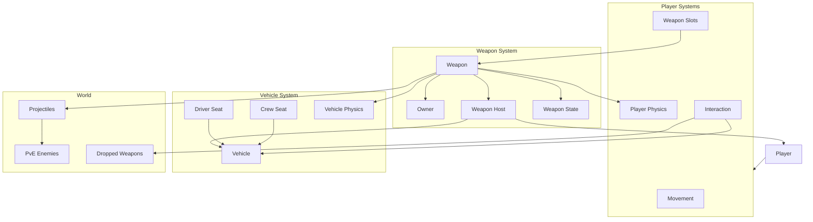

---

# 2. コアループ

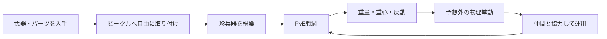

---

# 3. Player責務

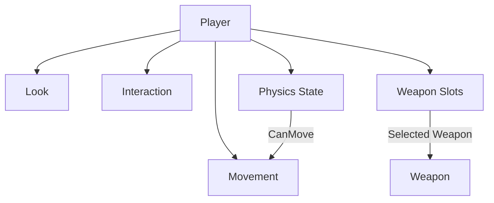

---

# 4. Player入力

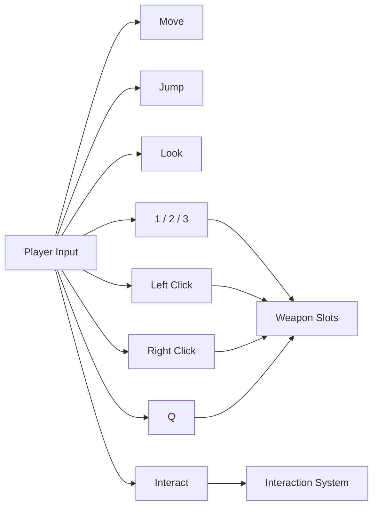

---

# 5. Player物理状態

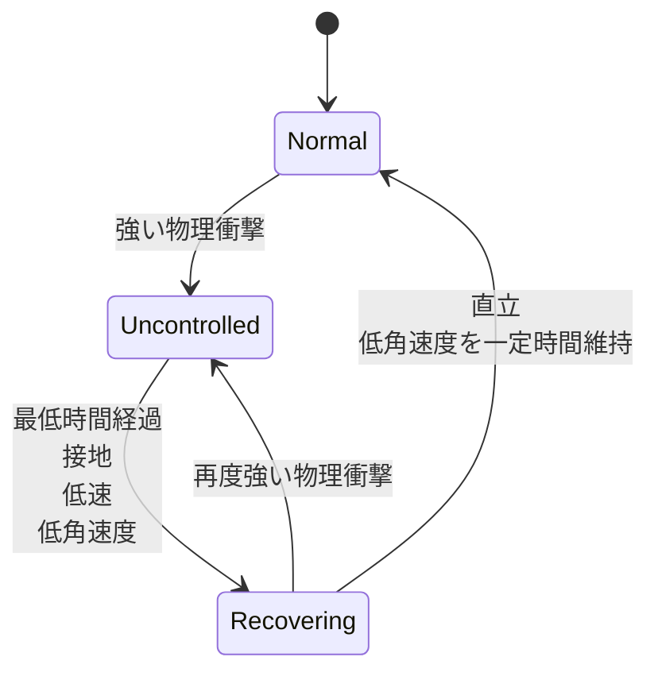

---

# 6. Player物理状態ごとの操作

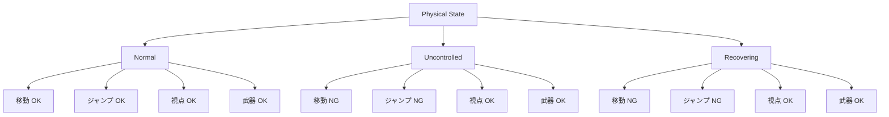

---

# 7. Player吹き飛び・復帰

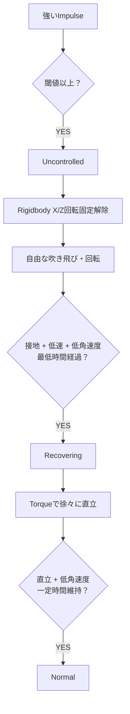

---

# 8. Weaponシステム

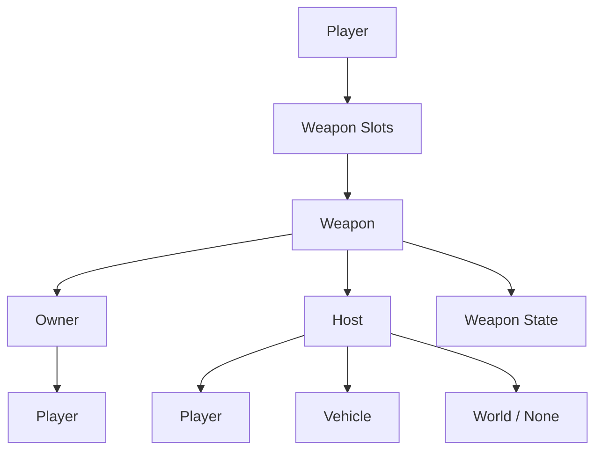

---

# 9. Weapon Owner / Host モデル

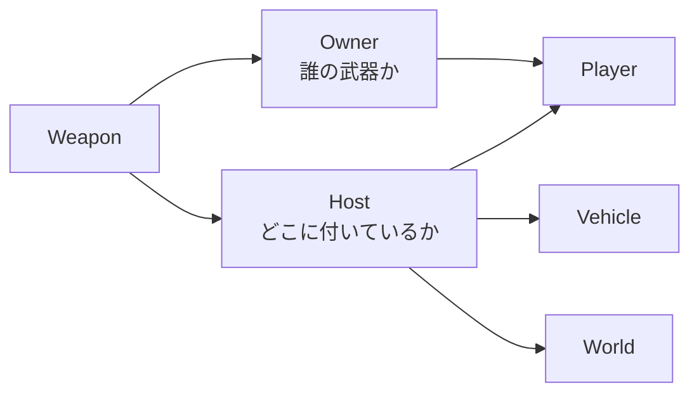

重要：

```text
Owner = 操作権・所有権

Host = 現在武器が物理的に取り付いている対象
```

この2つは独立して管理する。

---

# 10. Weapon状態

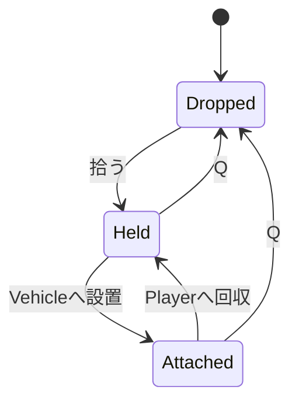

---

# 11. Weapon状態とOwner / Host

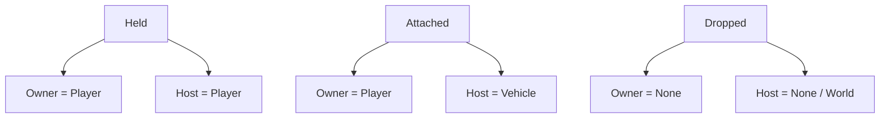

---

# 12. Weapon取得

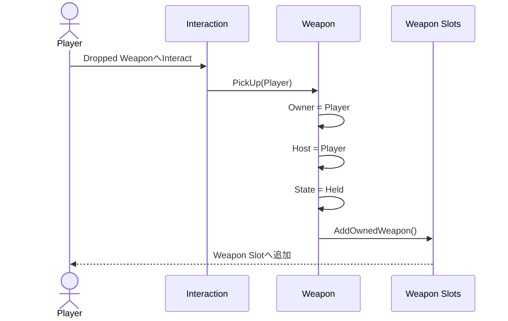

---

# 13. Weaponドロップ

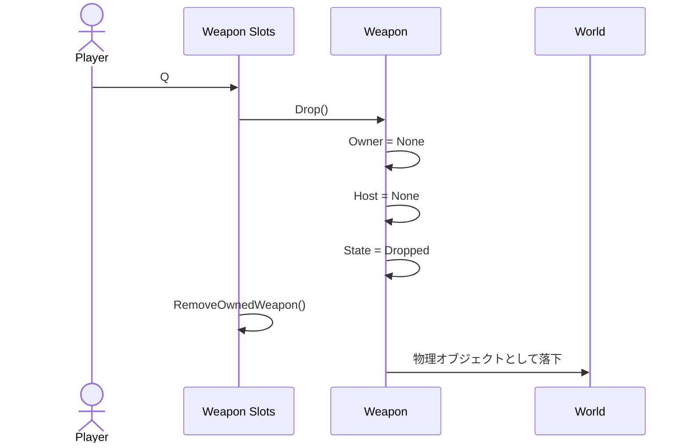

---

# 14. Weaponビークル取り付け

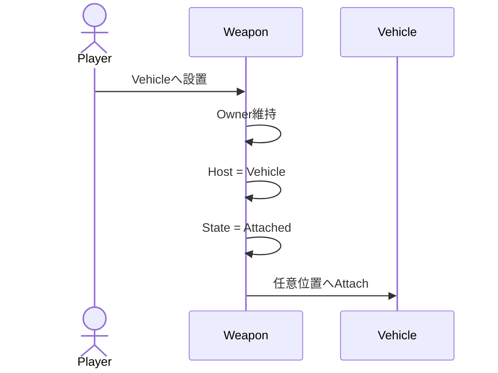

Ownerは変化しない。

---

# 15. Weapon Slot

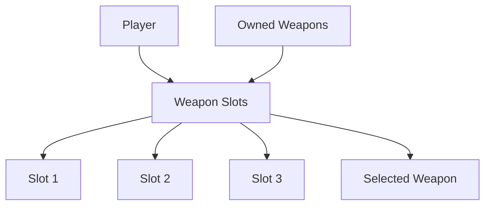

Weapon Slotは、

```text
手に持っている武器一覧
```

ではなく、

```text
Ownerが自分である武器一覧
```

として扱う。

---

# 16. Weapon選択

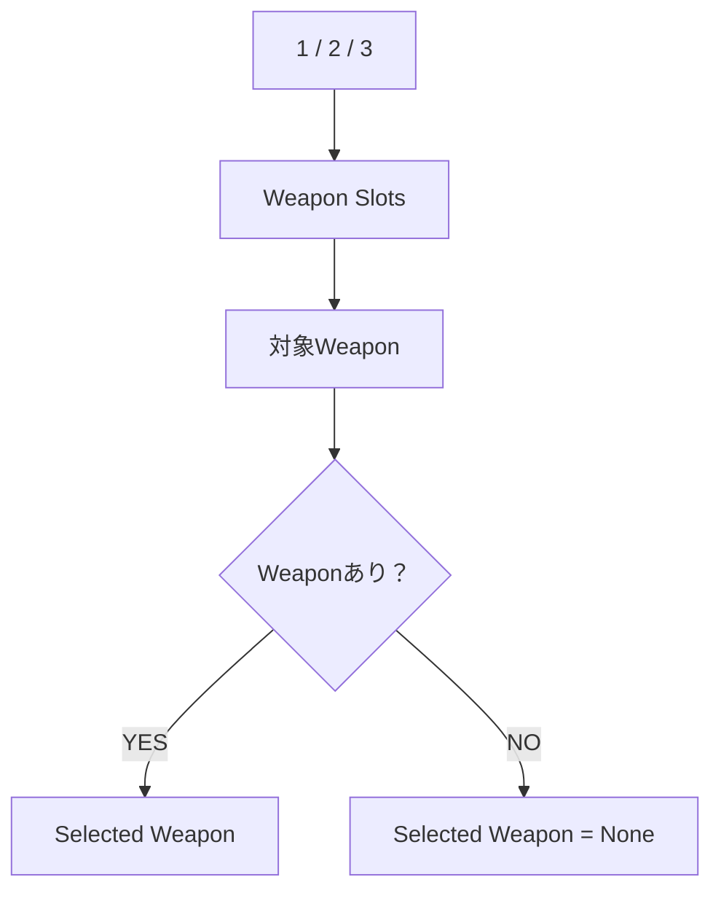

WeaponがVehicleへAttachedされていても選択可能。

---

# 17. Weapon入力

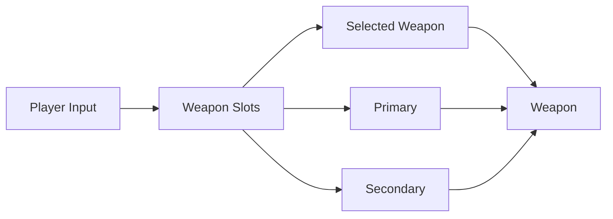

Weapon自身はキーボード・マウスを直接参照しない。

---

# 18. Weapon発射と反動

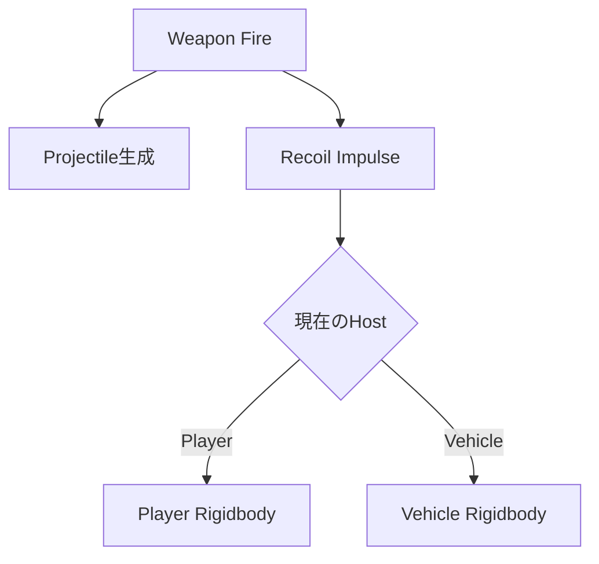

---

# 19. 手持ちWeapon反動

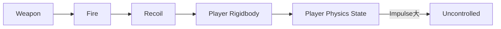

巨大武器ならPlayer自身が吹き飛ぶ。

---

# 20. Vehicle搭載Weapon反動

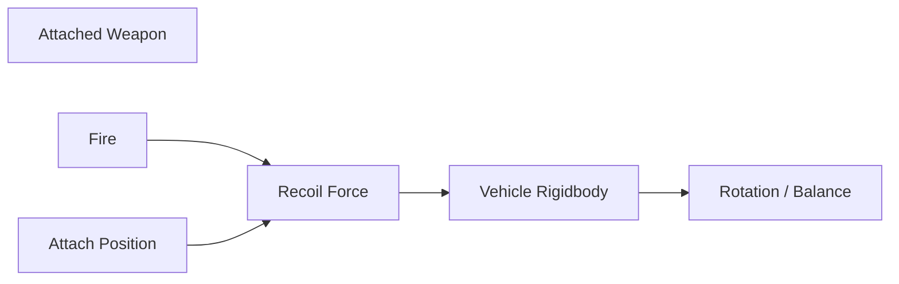

取り付け位置によって回転方向・姿勢への影響が変わる。

---

# 21. Vehicle基本構成

```mermaid
flowchart TB
    Vehicle["Vehicle"]

    Rigidbody["Rigidbody"]

    DriverSeat["Driver Seat"]

    CrewSeats["Crew Seats"]

    Attachments["Weapon / Parts"]

    VehiclePhysics["Vehicle Physics"]

    Vehicle --> Rigidbody

    Vehicle --> DriverSeat

    Vehicle --> CrewSeats

    Vehicle --> Attachments

    Rigidbody --> VehiclePhysics

    Attachments --> VehiclePhysics
```

---

# 22. Vehicle乗員構成

```mermaid
flowchart TB
    Vehicle["Vehicle"]

    Driver["Driver<br/>1人"]

    Crew1["Crew"]
    Crew2["Crew"]
    CrewN["Crew ..."]

    Vehicle --> Driver

    Vehicle --> Crew1
    Vehicle --> Crew2
    Vehicle --> CrewN
```

運転担当は1台につき1人。

乗組員数には厳しい固定上限を設けない方向。

---

# 23. Driver状態

```mermaid
stateDiagram-v2
    [*] --> OnFoot

    OnFoot --> Driving: Driver SeatへInteract

    Driving --> OnFoot: 降車
```

---

# 24. Driver中の操作制限

```mermaid
flowchart TB
    Driver["Driving"]

    Movement["Vehicle Movement"]
    Look["Look"]
    WeaponSelect["Weapon Slot Select"]
    WeaponFire["Weapon Fire"]

    Driver --> Movement
    Driver --> Look

    Driver -. disabled .-> WeaponSelect
    Driver -. disabled .-> WeaponFire
```

操縦席にいる間は武器スロット選択・武器操作を行えない。

---

# 25. Crew状態

```mermaid
stateDiagram-v2
    [*] --> OnFoot

    OnFoot --> Crew: Crew SeatへInteract

    Crew --> OnFoot: 降車
```

Crew Seatは武器操作権を取得する席ではない。

---

# 26. Crew Weapon操作

```mermaid
flowchart LR
    Crew["Crew Player"]

    Slots["Own Weapon Slots"]

    Weapon["Owned Weapon"]

    Vehicle["Vehicle"]

    Crew --> Slots

    Slots --> Weapon

    Weapon -->|"Owner"| Crew

    Weapon -->|"Host"| Vehicle

    Crew -->|"Primary / Secondary"| Weapon
```

乗組員はVehicle上でも、自分がOwnerのWeaponを通常どおり操作する。

---

# 27. Vehicleへの武器取り付け

```mermaid
flowchart TB
    Player["Player"]

    Weapon["Weapon"]

    Vehicle["Vehicle"]

    Position["任意位置"]

    Attach["Attach"]

    Mass["重量"]

    COM["重心"]

    Recoil["反動"]

    Player --> Weapon

    Weapon --> Attach

    Vehicle --> Position

    Position --> Attach

    Attach --> Mass
    Attach --> COM
    Attach --> Recoil

    Mass --> VehiclePhysics["Vehicle Physics"]
    COM --> VehiclePhysics
    Recoil --> VehiclePhysics
```

---

# 28. Vehicle物理

```mermaid
flowchart TB
    Vehicle["Vehicle Physics"]

    Base["Vehicle Base Performance"]

    Mass["Total Mass"]

    COM["Center of Mass"]

    Recoil["Weapon Recoil"]

    Vehicle --> Base
    Vehicle --> Mass
    Vehicle --> COM
    Vehicle --> Recoil

    Base --> Result["Final Behaviour"]
    Mass --> Result
    COM --> Result
    Recoil --> Result
```

---

# 29. 無茶なビルドの結果

```mermaid
flowchart LR
    Build["Player Build"]

    Heavy["重量過多"]
    BadCOM["偏った重心"]
    HugeGun["巨大Weapon"]
    BadPosition["極端な取付位置"]

    Slow["加速低下"]
    Hill["坂を登れない"]
    Roll["横転"]
    Fly["反動で吹き飛ぶ"]
    Unstable["姿勢不安定"]

    Build --> Heavy
    Build --> BadCOM
    Build --> HugeGun
    Build --> BadPosition

    Heavy --> Slow
    Heavy --> Hill

    BadCOM --> Roll
    BadPosition --> Unstable

    HugeGun --> Fly
```

基本思想：

```text
禁止する
    ↓
ではなく

許可する
    ↓
物理的な結果を返す
```

---

# 30. Weapon Host共通化

```mermaid
classDiagram
    class IWeaponHost {
        <<interface>>
        +Transform WeaponAttachRoot
        +Rigidbody Body
    }

    class Player

    class Vehicle

    class Weapon {
        +Player Owner
        +IWeaponHost Host
        +WeaponState State
    }

    Player ..|> IWeaponHost

    Vehicle ..|> IWeaponHost

    Weapon --> IWeaponHost : Host
```

PlayerとVehicleを、

```text
Weaponを取り付けられる
+
反動を受ける
```

対象として共通化する。

---

# 31. Weapon設計クラス図

```mermaid
classDiagram
    direction LR

    class PlayerWeaponSlots {
        +List~Weapon~ OwnedWeapons
        +Weapon SelectedWeapon

        +SelectSlot(int index)
        +DropSelectedWeapon()
        +AddOwnedWeapon(Weapon weapon)
        +RemoveOwnedWeapon(Weapon weapon)

        +PrimaryPressed()
        +PrimaryReleased()

        +SecondaryPressed()
        +SecondaryReleased()
    }

    class Weapon {
        +Player Owner
        +IWeaponHost Host
        +WeaponState State

        +SetOwner(Player owner)
        +AttachTo(IWeaponHost host)
        +Drop(Vector3 position)

        +PrimaryPressed()
        +PrimaryReleased()

        +SecondaryPressed()
        +SecondaryReleased()
    }

    class IWeaponHost {
        <<interface>>
        +Transform WeaponAttachRoot
        +Rigidbody Body
    }

    class Player

    class Vehicle

    class WeaponState {
        <<enumeration>>
        Held
        Attached
        Dropped
    }

    PlayerWeaponSlots o-- Weapon : Owned Weapons

    PlayerWeaponSlots --> Weapon : Selected Weapon

    Weapon --> Player : Owner

    Weapon --> IWeaponHost : Host

    Player ..|> IWeaponHost

    Vehicle ..|> IWeaponHost

    Weapon --> WeaponState
```

---

# 32. Player物理 設計クラス図

```mermaid
classDiagram
    direction LR

    class PlayerController {
        +HandleMove()
        +HandleJump()
        +HandleLook()
        +HandleWeaponInput()
    }

    class PlayerMovement {
        +Move(Vector2 input)
        +Jump()
        +CanMove() bool
    }

    class PlayerPhysicsController {
        -PhysicalState state
        -Rigidbody rigidbody

        +ApplyImpulse(Vector3 force, Vector3 point)

        +EnterUncontrolled()

        +CanStartRecovery() bool
        +StartRecovery()
        +UpdateRecovery()
        +FinishRecovery()

        +CanMove() bool
    }

    class PlayerWeaponController {
        +SelectWeapon(int slot)
        +FirePrimary()
        +FireSecondary()
    }

    class PhysicalState {
        <<enumeration>>
        Normal
        Uncontrolled
        Recovering
    }

    class Rigidbody {
        +velocity
        +angularVelocity
        +constraints

        +AddForce()
        +AddForceAtPosition()
        +AddTorque()
    }

    PlayerController --> PlayerMovement

    PlayerController --> PlayerWeaponController

    PlayerMovement --> PlayerPhysicsController

    PlayerPhysicsController --> PhysicalState

    PlayerPhysicsController --> Rigidbody

    PlayerMovement --> Rigidbody
```

---

# 33. Multiplayer Authority 概念図

```mermaid
flowchart LR
    ClientA["Client A"]

    ClientB["Client B"]

    Host["Listen Server / Host"]

    World["Authoritative World"]

    Physics["Physics"]

    Vehicle["Vehicles"]

    Weapons["Weapons"]

    Projectile["Projectiles"]

    ClientA -->|"Input Request"| Host

    ClientB -->|"Input Request"| Host

    Host --> World

    World --> Physics
    World --> Vehicle
    World --> Weapons
    World --> Projectile

    Host -->|"State Sync"| ClientA

    Host -->|"State Sync"| ClientB
```

プロトタイプではHost Authorityを基本候補とする。

---

# 34. Multiplayer Vehicle + Weapon

```mermaid
sequenceDiagram
    participant Driver as Driver Client
    participant Gunner as Crew Client
    participant Host
    participant Vehicle
    participant Weapon

    Driver->>Host: Vehicle Move Input

    Host->>Vehicle: Apply Movement

    Gunner->>Host: Weapon Fire Input

    Host->>Weapon: Fire

    Weapon->>Vehicle: Recoil

    Vehicle->>Vehicle: Physics Simulation

    Host-->>Driver: Vehicle State

    Host-->>Gunner: Vehicle / Weapon State
```

---

# 35. ネットワーク上の重要ケース

```mermaid
flowchart TD
    PlayerA["Player A"]

    PlayerB["Player B"]

    WeaponA["Weapon A<br/>Owner = A"]

    WeaponB["Weapon B<br/>Owner = B"]

    Vehicle["Same Vehicle Rigidbody"]

    Host["Host Authority"]

    PlayerA --> WeaponA

    PlayerB --> WeaponB

    WeaponA --> Vehicle

    WeaponB --> Vehicle

    Vehicle --> Host

    Host --> Physics["Single Physics Result"]

    Physics --> Clients["All Clientsへ同期"]
```

別Player所有の複数Weaponが、同じVehicle Rigidbodyへ反動を与えるケースを重要な検証対象とする。

---

# 36. 技術構成

```mermaid
flowchart TB
    Game["BadEngineering"]

    Unity["Unity 6"]

    URP["URP"]

    Rigidbody["Rigidbody Physics"]

    NGO["Netcode for GameObjects"]

    Listen["Listen Server"]

    HostAuthority["Host Authority"]

    PC["PC"]

    Game --> Unity

    Unity --> URP

    Unity --> Rigidbody

    Unity --> NGO

    NGO --> Listen

    Listen --> HostAuthority

    Game --> PC
```

---

# 37. パフォーマンス負荷構造

```mermaid
flowchart TB
    Performance["Performance"]

    CPU["CPU"]

    GPU["GPU"]

    Memory["Memory"]

    CPU --> Physics["Physics"]
    CPU --> Network["Network"]
    CPU --> Enemy["Enemy"]
    CPU --> Projectile["Projectiles"]

    Physics --> Rigidbody["Rigidbody Count"]
    Physics --> Collision["Collision Count"]

    Network --> Sync["Sync Object Count"]

    GPU --> URP["Lightweight URP"]

    Memory --> Objects["Runtime Objects"]
```

描画を必要以上に重くせず、

```text
Physics
+
Network
```

へ処理予算を残す。

---

# 38. プロトタイプ検証フロー

```mermaid
flowchart TD
    Step1["1. Rigidbody Vehicle"]

    Step2["2. Weaponを任意位置へAttach"]

    Step3["3. Weapon Fire"]

    Step4["4. Attach位置からVehicleへRecoil"]

    Step5["5. 位置によるVehicle挙動差を確認"]

    Step6["6. 2 Player Multiplayer"]

    Step7["7. Host Driver / Client Weapon"]

    Step8["8. Physics同期確認"]

    Step9["9. Performance計測"]

    Result{"コアシステム成立？"}

    Step1 --> Step2
    Step2 --> Step3
    Step3 --> Step4
    Step4 --> Step5
    Step5 --> Step6
    Step6 --> Step7
    Step7 --> Step8
    Step8 --> Step9

    Step9 --> Result
```

---

# 39. 仕様全体の超簡略図

```mermaid
flowchart LR
    Player["Player"]

    Weapon["Owned Weapon"]

    Vehicle["Vehicle"]

    Enemy["PvE"]

    Player -->|"Own"| Weapon

    Weapon -->|"Attach"| Player

    Weapon -->|"Attach"| Vehicle

    Player -->|"Drive / Ride"| Vehicle

    Weapon -->|"Fire"| Enemy

    Weapon -->|"Recoil"| Player

    Weapon -->|"Recoil"| Vehicle

    Vehicle -->|"Physics"| World["World"]

    Player -->|"Co-op"| Other["Other Players"]
```

---

# 40. BadEngineeringの中心概念

```mermaid
flowchart TB
    Core["BadEngineering"]

    Freedom["自由な取り付け"]

    Ownership["PlayerごとのWeapon Ownership"]

    Physics["物理的な結果"]

    Coop["複数人での協力"]

    Vehicle["Vehicle"]

    Weapon["Weapon"]

    Core --> Freedom
    Core --> Ownership
    Core --> Physics
    Core --> Coop

    Freedom --> Weapon
    Freedom --> Vehicle

    Ownership --> Weapon

    Physics --> Weapon
    Physics --> Vehicle

    Coop --> Vehicle
    Coop --> Weapon
```
